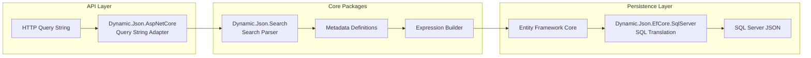
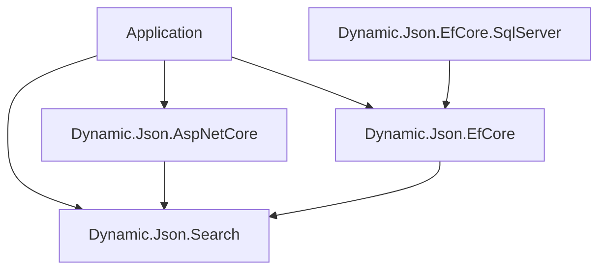

# Dynamic.Json.EfCore

[](https://github.com/jfairbourn96/dynamic-json-efcore/actions/workflows/ci.yml)
[](https://www.nuget.org/packages/Dynamic.Json.Search)
[](https://www.nuget.org/packages/Dynamic.Json.EfCore)
[](https://www.nuget.org/packages/Dynamic.Json.EfCore.SqlServer)
[](https://www.nuget.org/packages/Dynamic.Json.AspNetCore)

## Introduction

Dynamic.Json.EfCore is a set of .NET packages for building applications with user-defined JSON fields without giving up EF Core mapping, change tracking, validation, or SQL-backed querying.

It is designed for relational applications that need flexible, metadata-driven fields such as custom profile attributes, dynamic forms, tenant-specific fields, configurable records, or admin-defined search filters. Instead of treating JSON columns as opaque blobs, the package set provides typed search parsing, EF Core JSON value conversion, provider-specific SQL translation, and ASP.NET Core query-string adapters.

At its core, Dynamic.Json.EfCore lets developers treat metadata-defined fields as first-class citizens—searchable, validated, and queryable through Entity Framework Core instead of as raw JSON strings.

## Is This the Right Fit?

This package set is designed for relational applications where most of the data model is stable, but a subset of fields must be defined at runtime.

Typical scenarios include:

- [HR systems with employee-type-specific fields](https://github.com/jfairbourn96/dynamic-hr-demo)
- CRM platforms with tenant-defined contact attributes
- Workflow applications with dynamic intake forms
- Asset management systems with configurable metadata
- SaaS products that allow customers to define searchable custom fields

Consider Dynamic.Json.EfCore if you want to:

- Store user-defined fields in JSON while keeping the rest of your model relational.
- Generate forms, validation, and search filters from runtime metadata.
- Execute filtering in SQL instead of loading records into memory.
- Continue using Entity Framework Core, SQL Server, and strongly typed application code.

It is **not** intended to replace a document database. If your application is primarily document-oriented or your entire schema is dynamic, a native document database may be a better choice.

## Design Philosophy

Dynamic.Json.EfCore is built around the idea that most business applications don't need an entirely dynamic database—they need a relational model with a flexible extension point.

Rather than generating tables and columns at runtime or treating JSON as an opaque blob, the package stores only the dynamic portion of an entity as JSON.

Metadata defines the structure of those fields, enabling validation, search parsing, provider-specific SQL translation, and integration with the rest of your EF Core model.

This approach lets applications retain the strengths of Entity Framework Core—including change tracking, migrations, LINQ integration, and relational performance—while allowing metadata-driven fields to evolve without database schema changes.

## Architecture Overview

A typical request flows through the package set like this:



Incoming query parameters are parsed into strongly typed search criteria, validated against runtime metadata, translated into LINQ expression trees, and finally converted into provider-specific SQL that executes directly against SQL Server JSON columns.

## Packages

Install the package for the layer you are building:

```powershell
dotnet add package Dynamic.Json.Search
dotnet add package Dynamic.Json.EfCore
dotnet add package Dynamic.Json.EfCore.SqlServer
dotnet add package Dynamic.Json.AspNetCore
```

| Package | Use it for |
|---|---|
| [`Dynamic.Json.Search`](https://www.nuget.org/packages/Dynamic.Json.Search) | Provider-neutral dynamic search field/filter models, parser, and parse result/error contracts. |
| [`Dynamic.Json.EfCore`](https://www.nuget.org/packages/Dynamic.Json.EfCore) | Provider-neutral EF Core primitives for JSON conversion, value comparison, and EF query marker functions. |
| [`Dynamic.Json.EfCore.SqlServer`](https://www.nuget.org/packages/Dynamic.Json.EfCore.SqlServer) | SQL Server translation for provider-neutral JSON query functions such as string, decimal, and date lookups. |
| [`Dynamic.Json.AspNetCore`](https://www.nuget.org/packages/Dynamic.Json.AspNetCore) | ASP.NET Core query-string adapters and service registration for dynamic search parsing. |

The current package version is `0.2.1-preview.1` and targets `.NET 10`.

## Quick Start

Map a `JsonObject` property with EF Core:

```csharp
using System.Text.Json.Nodes;
using Dynamic.Json.EfCore.Metadata;

public sealed class Employee
{
    public int Id { get; set; }
    public JsonObject FieldValues { get; set; } = new();
}

protected override void OnModelCreating(ModelBuilder modelBuilder)
{
    modelBuilder.Entity<Employee>(entity =>
    {
        entity.Property(e => e.FieldValues).HasJsonConversion();
    });
}
```

Enable SQL Server JSON translation:

```csharp
using Dynamic.Json.EfCore.SqlServer;

options.UseSqlServer(connectionString)
    .UseDynamicJsonSqlServer();
```

Query JSON values through provider-neutral marker functions:

```csharp
using Dynamic.Json.EfCore.Querying;

var seniorEmployees = await db.Employees
    .Where(employee =>
        DynamicJsonFunctions.Value(employee.FieldValues, "$.certificationLevel") == "senior")
    .ToListAsync();
```

Parse dynamic search parameters in an application or API layer:

```csharp
using Dynamic.Json.Search;

var fields = new[]
{
    new DynamicSearchField("certificationLevel", DynamicSearchFieldType.Select, new[] { "junior", "senior" }),
    new DynamicSearchField("hourlyRate", DynamicSearchFieldType.Number),
    new DynamicSearchField("remoteEligible", DynamicSearchFieldType.Boolean),
};

var parser = new DynamicSearchQueryParser();
var result = parser.Parse(
    new Dictionary<string, string?>
    {
        ["certificationLevel"] = "senior",
        ["hourlyRate_gte"] = "75",
        ["remoteEligible"] = "true",
    },
    fields);

if (result.Errors.Count > 0)
{
    // Return structured validation errors to the caller.
}
```

ASP.NET Core apps can register parser services and parse `IQueryCollection` directly:

```csharp
using Dynamic.Json.AspNetCore;

builder.Services.AddDynamicJsonAspNetCore();

var result = parser.Parse(Request.Query, fields);
```

## Real-World Example

For a full application built around these packages, see [Dynamic HR Demo](https://github.com/jfairbourn96/dynamic-hr-demo). It is a metadata-driven employee record system that uses Dynamic.Json for runtime-defined fields, dynamic validation, JSON persistence, SQL Server filtering, clean architecture boundaries, and an end-to-end React UI.

## Engineering Highlights

- Package boundaries keep search parsing, ASP.NET Core adapters, EF Core mapping, and SQL Server translation separate.
- The search parser is provider-neutral, so application services can validate filters without referencing ASP.NET Core, EF Core, or SQL Server.
- SQL Server translation uses EF Core SQL expression APIs rather than raw SQL string concatenation.
- Dynamic field names, operators, number/date/boolean values, and select options are validated before query translation.
- JSON value comparison supports semantic and serialized modes for different correctness/performance tradeoffs.
- Unit tests cover provider-neutral behavior; Docker/Testcontainers integration tests verify SQL Server persistence and generated SQL.
- CI builds, tests, packs, runs vulnerability checks, publishes coverage summaries, and runs SQL Server integration tests.

## Package Architecture

The package set is intentionally split so applications only reference the layers they need.



### Package Responsibilities

- **Dynamic.Json.Search** owns the provider-neutral search language, metadata models, parser, validation, and parse results. These concepts are independent of EF Core or ASP.NET Core and can be used by applications, workers, tests, or other entry points.

- **Dynamic.Json.AspNetCore** adapts `IQueryCollection` into the provider-neutral parser input and registers ASP.NET Core services. It contains no business validation or database-specific behavior.

- **Dynamic.Json.EfCore** provides provider-neutral EF Core primitives including JSON mapping, value comparison, and LINQ marker functions.

- **Dynamic.Json.EfCore.SqlServer** translates those provider-neutral marker functions into SQL Server expressions such as `JSON_VALUE` and `TRY_CONVERT`, keeping SQL Server implementation details isolated from the rest of the package set.

## Repository Layout

```text
Dynamic.Json.Search/                  Provider-neutral dynamic search filter models and parser
Dynamic.Json.EfCore/                  Provider-neutral JSON mapping, tracking, and query markers
Dynamic.Json.AspNetCore/              ASP.NET Core dynamic search query adapters
Dynamic.Json.EfCore.SqlServer/        SQL Server EF Core JSON query translations
Dynamic.Json.EfCore.UnitTests/        Unit tests for the package set
Dynamic.Json.EfCore.IntegrationTests/ Docker/Testcontainers-backed SQL Server integration tests
docs/                                 Package documentation and test coverage notes
TODO.md                               Follow-up work and publishing checklist
```

## JSON Mapping and Change Tracking

`HasJsonConversion()` configures a `JsonObject` property to be stored as serialized JSON and tracked deeply by EF Core:

```csharp
protected override void OnModelCreating(ModelBuilder modelBuilder)
{
    modelBuilder.Entity<Employee>(entity =>
    {
        entity.Property(e => e.FieldValues).HasJsonConversion();
    });
}
```

By default, `HasJsonConversion()` uses `JsonObjectComparisonMode.Semantic`:

```csharp
entity.Property(e => e.FieldValues)
    .HasJsonConversion(JsonObjectComparisonMode.Semantic);
```

Semantic comparison treats JSON objects as structured data rather than serialized text:

- Object property order does not affect equality.
- Nested objects are compared recursively.
- Arrays are compared in order, so array ordering remains significant.
- `null` equals `null`, but `null` does not equal a populated JSON object.
- `null` hashes to `0`.

These objects are considered equal because they contain the same properties and values:

```json
{ "name": "Jimmy", "occupation": "Lawyer" }
```

```json
{ "occupation": "Lawyer", "name": "Jimmy" }
```

Arrays remain order-sensitive, so these arrays are not equal:

```json
["Kim", "Jimmy"]
```

```json
["Jimmy", "Kim"]
```

For applications that prefer faster, property-order-sensitive comparison, use `JsonObjectComparisonMode.Serialized`:

```csharp
entity.Property(e => e.FieldValues)
    .HasJsonConversion(JsonObjectComparisonMode.Serialized);
```

Use semantic comparison when JSON object property order should not matter. Use serialized comparison when raw comparison speed is more important and callers are comfortable with property-order-sensitive change detection.

## Dynamic Search

The provider-neutral parser converts key/value pairs into typed dynamic filters. For example:

```text
favoriteSongName_contains=Go
numberOfSongs_gte=7
hasIcePowers=true
```

The parser validates:

- supported field names
- supported operators for each field type
- number, date, boolean, and select-option values
- ignored framework/application query parameters such as paging keys

Errors are returned as structured parse errors with stable error codes, allowing API consumers to format or localize messages without relying on exception text.

ASP.NET Core applications can use `Dynamic.Json.AspNetCore` to adapt `IQueryCollection` into the provider-neutral parser. Non-HTTP applications can pass dictionaries or other simple key/value inputs directly to `Dynamic.Json.Search`.

## SQL Server Translation

`Dynamic.Json.EfCore.SqlServer` translates provider-neutral marker functions into SQL Server expressions:

```csharp
DynamicJsonFunctions.Value(employee.FieldValues, "$.favoriteSongName")
DynamicJsonFunctions.ValueDecimal(employee.FieldValues, "$.numberOfSongs")
DynamicJsonFunctions.ValueDate(employee.FieldValues, "$.coronationDate")
```

The SQL Server package plugs into EF Core through:

```csharp
options.UseSqlServer(connectionString)
    .UseDynamicJsonSqlServer();
```

The translator uses EF Core SQL expression APIs instead of raw SQL string concatenation. Store type fragments used by `TRY_CONVERT` are fixed internally, and user values are kept in EF expression translation.

The SQL Server integration tests exercise this behavior against a real SQL Server 2022 container. They verify that `JsonObject` values persist and reload through `HasJsonConversion()`, string lookups translate through `JSON_VALUE`, numeric lookups use `TRY_CONVERT(decimal(18, 4), JSON_VALUE(...))`, date lookups use `TRY_CONVERT(date, JSON_VALUE(...))`, and generated SQL contains the expected SQL Server JSON functions.

## Security Notes

- Dynamic JSON search uses EF Core expression translation rather than raw SQL construction.
- Dynamic field names are validated before they are converted into JSON paths.
- LIKE patterns escape wildcard characters before filtering.
- Package vulnerability checks run in CI:

```powershell
dotnet list Dynamic.Json.EfCore.slnx package --vulnerable --include-transitive
```

## Build and Test

Build the package solution:

```powershell
dotnet build Dynamic.Json.EfCore.slnx
```

Run unit tests:

```powershell
dotnet test Dynamic.Json.EfCore.UnitTests\Dynamic.Json.EfCore.UnitTests.csproj
```

Run SQL Server integration tests:

```powershell
dotnet test Dynamic.Json.EfCore.IntegrationTests\Dynamic.Json.EfCore.IntegrationTests.csproj
```

The integration tests use `Testcontainers.MsSql` and require Docker to be running. The first run may take longer while Docker pulls the SQL Server 2022 image. Each test creates an isolated database from the container connection string, so tests can share one container without sharing data.

Collect coverage:

```powershell
dotnet test Dynamic.Json.EfCore.UnitTests\Dynamic.Json.EfCore.UnitTests.csproj --settings coverlet.runsettings --results-directory artifacts\coverage\raw --collect "XPlat Code Coverage"
```

CI generates an HTML/Cobertura coverage report from the unit test suite, publishes the Markdown summary to the GitHub Actions job summary, uploads the full report as a `coverage-report` artifact, packs the NuGet packages, and runs SQL Server integration tests on `ubuntu-latest`.

Coverage notes for the package set live in [`docs/test-coverage.md`](docs/test-coverage.md).

## Roadmap

Near-term follow-up work is tracked in [`TODO.md`](TODO.md), including:

- JsonArray support
- Future PostgreSQL support.
- Future Newtonsoft/JObject support.
- Swagger/OpenAPI documentation after selecting a package version without known vulnerabilities.
